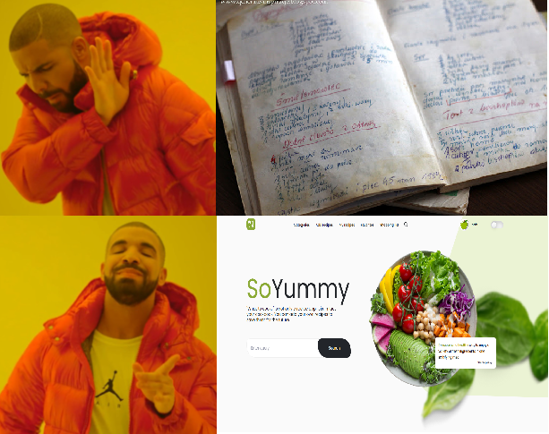
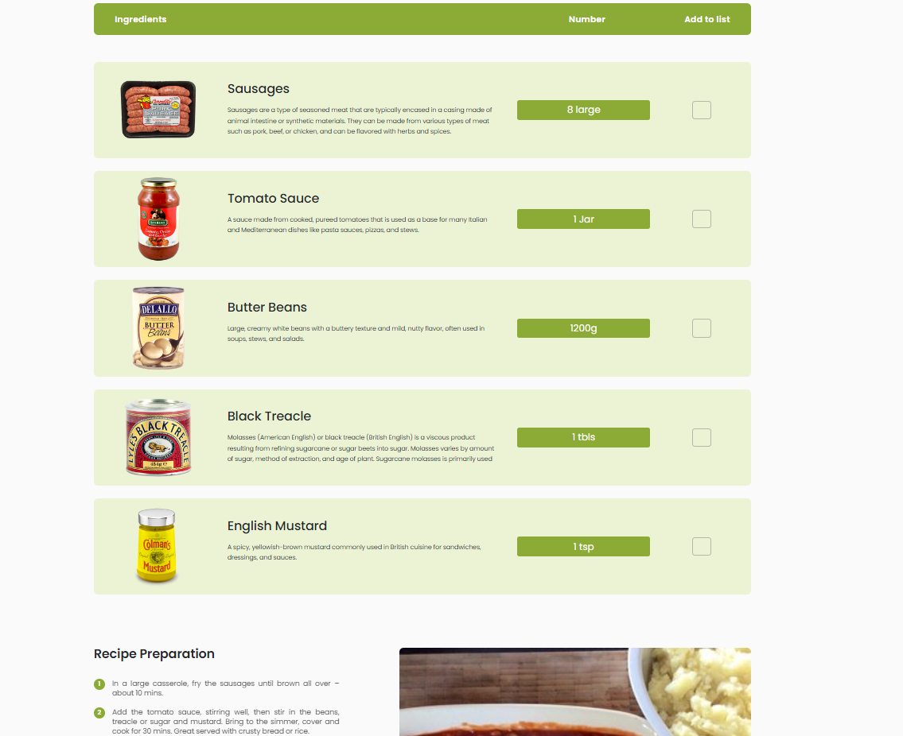

Project backend:

https://github.com/ArkadiuszMyszka/yumtastic-creations

# Table of Contents

- Introduction
- Technologies
- Running the Application
- Illustrations
- Features Scope
- Usage Examples
- Project Status

## SoYummy

Welcome to SoYummy - the place where your culinary dreams become reality! Have you ever wondered what to do with those exotic ingredients sitting in your pantry? Or perhaps you're eager to explore new flavor horizons? Well, SoYummy is the answer to your culinary-philosophical questions!

Why did the tomato turn red?
Because it saw the salad dressing!

## Introduction

SoYummy is a culinary application that gathers recipes from all around the world, allowing you to explore culinary flavors and discover new cuisines. This project was created with the aim of providing users not only with recipes but also with convenient tools to manage their culinary journey.

### Technologies

The project has been built using various technologies, including:

- React
- Node.js
- Express.js
- MongoDB
- Jsonwebtoken
- Passport

### Running the Application

To run the SoYummy application locally, follow these steps:

1. Clone the repository to your computer.
2. Navigate to the project directory.
3. Install dependencies using the command npm install.
4. Start the application in development mode by entering the command npm start.

##### Illustrations

SoYummy is not just a collection of recipes but also a place where your culinary dreams become reality. Below are some screenshots from our application:

##### Features Scope

- Browsing recipes from various cuisines.
- Adding favorite recipes.
- Creating a shopping list based on recipes.
- Adding custom recipes.

###### Usage Examples

- Finding something tasty to cook.
- Sharing your own recipe with the world.
- Drawing inspiration for your culinary development.
- Saving paper using the built-in "Shopping List" feature.

###### Adding a Recipe

Don't worry. At worst, someone might not like it, but perhaps you'll become the next Gordon Ramsay :)

##### Project Status

Our project is under construction and undergoing continuous improvements to ensure the best possible experience for you. We eagerly await your feedback and ideas for what new features we can add!

