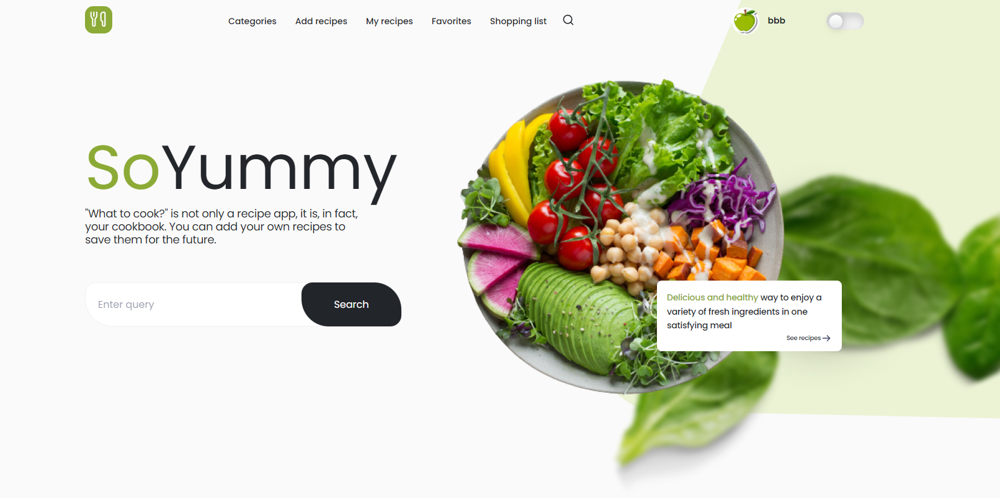
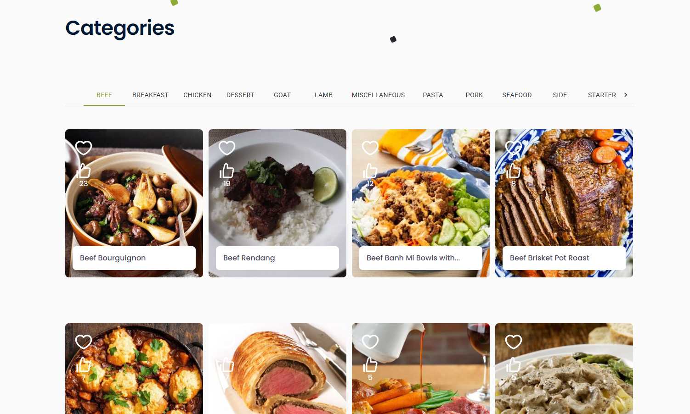
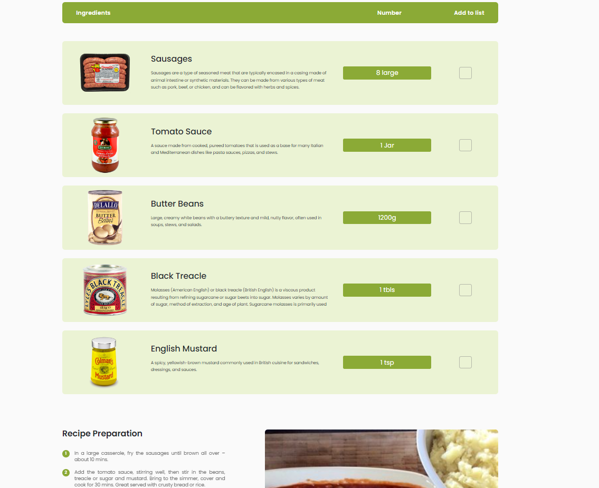
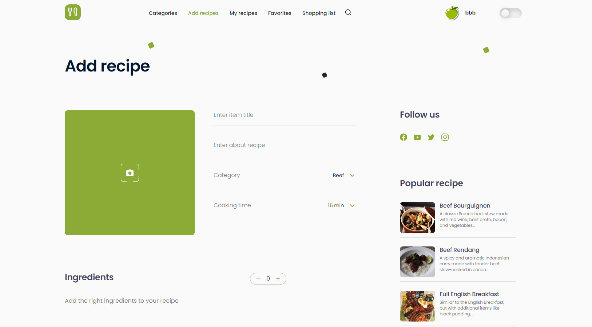

Projekt backend:

https://github.com/ArkadiuszMyszka/yumtastic-creations

# Spis treści

- Wprowadzenie
- Technologie
- Uruchomienie
- Ilustracje
- Zakres funkcjonalności
- Przykłady użycia
- Status projektu

## SoYummy

Witaj w SoYummy - miejscu, gdzie Twoje kulinarne marzenie stają się rzeczywistością! Czy kiedykolwiek zastanawiałeś się, co zrobić z tymi egzotycznymi składnikami znajdującymi się w Twojej spiżarni? A może masz ochotę odkryć nowe smakowe horyzonty? No cóż, SoYummy to odpowiedź na Twoje kulinarno-filozoficzne pytania!

Dlaczego kucharz nigdy nie mówi kłamstwa?
Bo zawsze trzyma się przepisu! 

## Wprowadzenie

SoYummy to aplikacja kulinarna, która gromadzi przepisy ze wszystkich zakątków świata, pozwalając Ci eksplorować kulinarne smaki i odkrywać nowe kulinaria. Projekt ten powstał z myślą o dostarczeniu użytkownikom nie tylko przepisów, ale także wygodnych narzędzi do zarządzania swoją kulinarną podróżą.

### Technologie

Projekt został zbudowany miedzy innymi przy użyciu technologii:

- React
- Node.js
- Express.js
- MongoDB
- Jsonwebtoken
- Passport

### Uruchomienie

Aby uruchomić aplikację SoYummy lokalnie, wykonaj następujące kroki:

1. Sklonuj repozytorium na swój komputer.
2. Przejdź do katalogu projektu.
3. Zainstaluj zależności przy użyciu komendy `npm install`.
4. Uruchom aplikację w trybie deweloperskim, wpisując komendę `npm start`.

##### Ilustracje

SoYummy to nie tylko zbiór przepisów, ale także miejsce, gdzie Twoje kulinarne marzenia stają się realnością. Zobacz poniżej kilka zrzutów ekranu z naszej aplikacji:

##### Zakres funkcjonalności

- Przeglądanie przepisów z różnych kuchni.
- Dodawanie ulubionych przepisów.
- Tworzenie listy zakupów na podstawie przepisów.
- Dodawanie własnych przepisów.

###### Przykłady użycia

- Szukanie co wrzucić na ząb
- Podzielenie się autorskim przepisem z całym światem
- Czerpanie inspiracji na własny rozwój kulinarny 
- Oszczędzenie papieru przy użyciu wbudowanym "Shopping List"

###### Dodawanie przepisu

Nie bój się. Najwyżej komuś nie posmakuje a może zostaniesz nowym Gordon'em Ramsay'em :)

##### Status projektu

Nasz projekt jest w trakcie budowy oraz niekończących się ulepszeń aby wasze wrażenia z naszej aplikacji były jak najlepsze. Czekamy z niecierpliwością na wasz feedback oraz pomysły co nowego możemy dodać!

